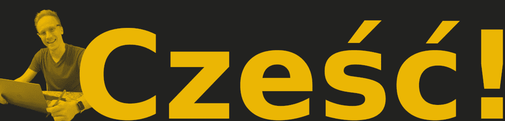

<link rel="stylesheet" href="style.css">

# Piotr Wójcik, English Editor

<h3>
Professional English editing and proofreading services

<a href="index.html" title="Kliknij tutaj, aby zobaczyć wersję polską">🇵🇱</a>

</h3>

[Home](index_en.md)  /  [About](about.md)  /  [Pricing](pricing.md)  /  [Contact](contact.md)

---

Looking for a fast and reliable English editing service?

# You've come to the right place.

My name is Piotr Wójcik and I offer a wide variety of proofreading and editing services for many different types of texts, including translated materials, scientific articles, business and marketing copy, literary works, biographical texts, college applications, and more. I have degrees from some of the top schools in the US and years of academic and professional experience in English-language editing. You can rest easy knowing that your text is in good hands and will return to you with the highest possible quality. Please feel free to take advantage of my [services](pricing.md).

---

<a target="_blank" href="https://veilmail.io/e/fuGedM">e-mail</a>

<a href="https://linkedin.com/in/pioioiotr">LinkedIn</a>

